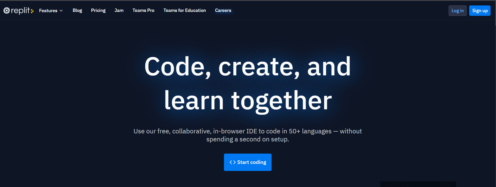
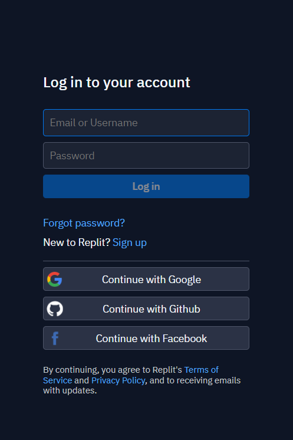
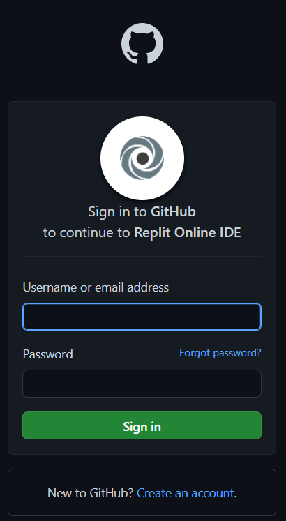
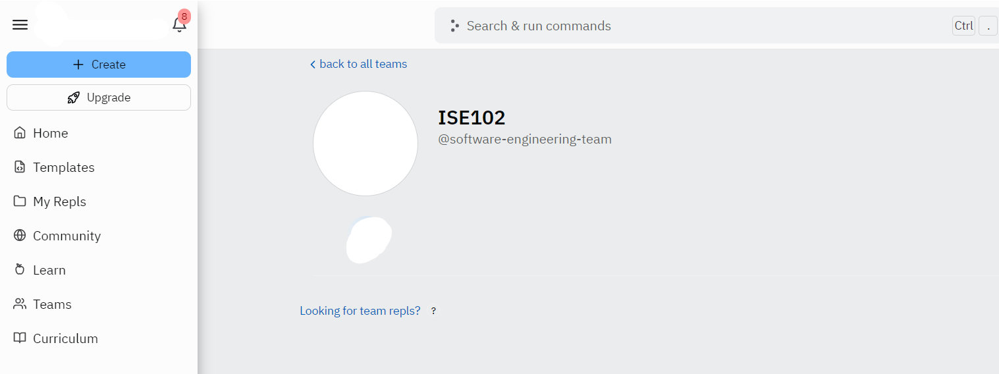

# Introduction to Replit

Replit is a coding platform that lets you write code and host apps. It also has many educational features built-in, making it great for teachers and learners too.

## Learning Code: Replit for Students
If you're learning to code, whether as a self-taught programmer or as part of another course, you'll find our learning resources useful.

You can work through our [project-based tutorials](https://docs.replit.com/tutorials/00-overview) to learn how to code, or download them all as an [ebook](https://www.codewithreplit.com/).

If you're learning a specific language, we probably cover it in one of our teacher-contributed [open curricula](https://docs.replit.com/teaching-curriculum/intro-teaching-curriculum).

We also have a beginner-friendly [Discord server](https://discord.util.repl.co/join) where you can get (and give) help on nearly anything.

## How to Create Replit Accout

**Requirement**: Github account

First go to [replit.com](https://replit.com/)

In the main page click on log in on right top of the page : 

Then in the login page click on **Continue with Github**

After choosing **Continue with Github** account, the site redirect you to the github's login page: 

Write down your username and password in the form then click **Sign in**

> **Congratulation**
> 
> You have created a Replit account, now you can run and debug your codes.

Here is the class link at [replit](http://replit.com) :

> ***Note :**
> 
> Be sure to login with your github account first then continue:

https://replit.com/teams/join/vvvuygqxuypsahbbhrgdylwythzfilbf-ITP122

After click on link you'll join the **ITP122** class :

please submit your activity to improve your coding and join in team:

## Resources : 

1.https://www.softwaretestinghelp.com/cpp-applications/

2.https://pathapadha.pythonanywhere.com/articles/c++/i1002

3.Dawson, M. (2014). Beginning c++ through game programming. Cengage Learning.
